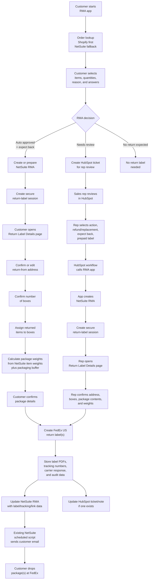
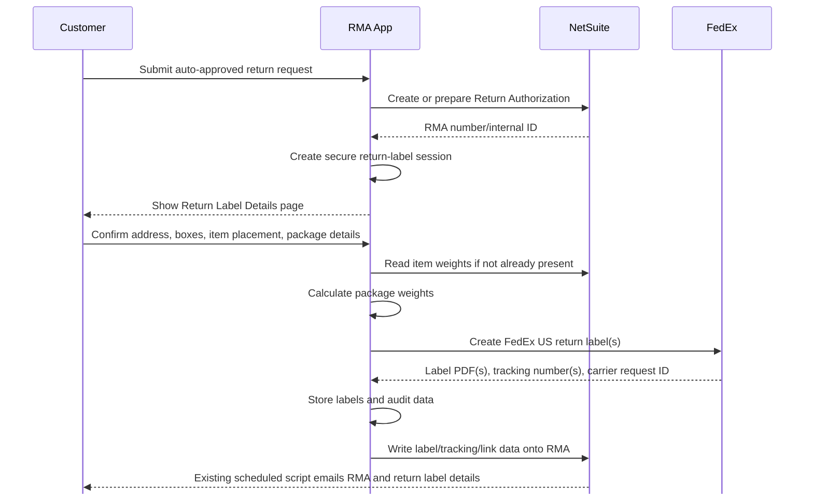
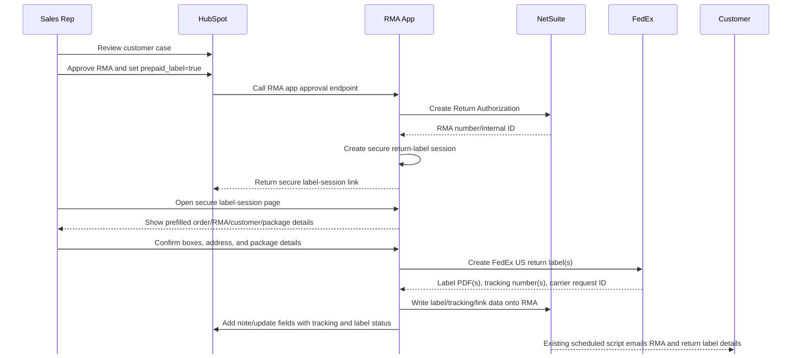
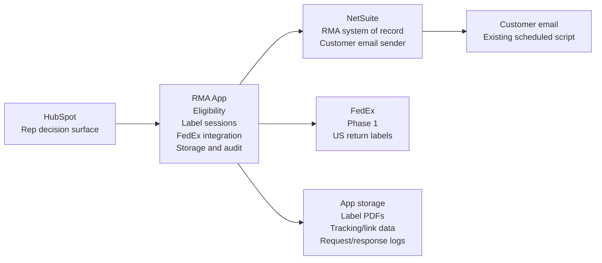

# RMA Return Label Workflow Proposal

**Date:** 2026-05-07
**Phase 1 scope:** FedEx US return labels only
**Phase 2 scope:** Canada return labels after carrier decision, likely Canada Post or Canpar

## Executive Summary

We should build return-label generation as a post-approval workflow inside the RMA Automation app.

The RMA app should not create labels immediately when a return is approved unless all package details are already known. Instead, the app creates a secure return-label session where the customer or sales rep confirms the return address, package count, package contents, and calculated weights. After that, the app creates the FedEx label(s), stores label data, updates NetSuite and HubSpot, and lets the existing NetSuite scheduled email script send the customer-facing email.

Important email decision:

- The RMA app will not be the primary customer email sender for return labels.
- Once the RMA and label data are ready, NetSuite remains responsible for customer email delivery through the existing scheduled script.
- The app will piggyback on that NetSuite process by writing label/tracking/link data back to NetSuite.

## End-To-End Journey



## Customer Journey



## Sales Rep Journey



## System Responsibilities



## Product Rules

- Label generation happens only after an RMA is approved or prepared for approval.
- Phase 1 supports FedEx US return labels only.
- Canada is Phase 2 and should wait until the carrier decision is made: Canada Post vs Canpar.
- HubSpot reps must call the RMA app. HubSpot must not call FedEx directly.
- The app generates labels only when the final decision says:
  - `expectsBack=true`
  - `prepaid_label=true`
- If no product return is expected, no label session is created.
- If customer package details are incomplete, create a label session but do not create the FedEx label yet.
- Multiple boxes must be supported.
- Each generated label must store carrier, tracking number, package number, package weight, label PDF, request ID, response ID, RMA number, and case ID.
- NetSuite remains the source of truth for RMA records.
- The app must write label/tracking/link data back to NetSuite so the existing NetSuite scheduled email can include the label details.

## Package And Weight Rules

NetSuite item records should be the source of truth for product weight.

Suggested package weight formula:

```text
package_weight = sum(item_weight * returned_quantity_in_package) + packaging_buffer
```

Recommended defaults:

- Use NetSuite item weight for each returned line.
- Add a configurable packaging buffer, for example `+1 lb` or `+10%`.
- Store both calculated weight and final submitted weight.
- Let customer or rep confirm package count.
- Let customer or rep assign items to boxes if there are multiple boxes.
- Do not let customers reduce calculated weight below a safe minimum.
- Dimensions should come from SKU/product defaults where possible.
- If dimensions are unknown, use configurable default dimensions by product category or store.

## Secure Return-Label Session

The return-label page should be shared by customers and reps.

Example route:

```text
/return-labels/session/{secureToken}
```

Session rules:

- Token must be random and hard to guess.
- Token must expire.
- Token must be tied to one case/RMA/order.
- Token must not expose raw NetSuite internal IDs in the URL.
- Token should have a role/mode: `customer` or `rep`.
- Session should become locked after labels are generated unless a manager/reissue action is used.
- Every label generation or reissue must be logged.

## Return Label Details Page

The page should collect:

- Return-from address, prefilled from original ship-to address.
- Customer phone number if FedEx requires it.
- Number of boxes.
- Items included in each box.
- Calculated package weight.
- Package dimensions.
- Confirmation checkbox that package details are correct.

The page should show:

- RMA number or case number.
- Items approved for return.
- Box-by-box package summary.
- Label status.
- FedEx tracking number(s) after generation.

## NetSuite Email Piggyback

Because NetSuite already sends customer RMA emails through a scheduled script, the app should update NetSuite after label creation.

Minimum NetSuite data to write back:

- Carrier: `FedEx`
- Tracking number(s)
- Label URL(s) or NetSuite File Cabinet file reference(s)
- Package count
- Package weights
- Label creation status
- Label created timestamp
- App return-label session ID

Two possible implementation options:

1. App-hosted secure label link:
   - App stores PDF in existing storage.
   - App writes secure download URL to NetSuite.
   - NetSuite email includes the link.

2. NetSuite File Cabinet attachment:
   - App uploads label PDF to NetSuite File Cabinet or a custom record.
   - NetSuite scheduled script attaches/includes the file.
   - This is more NetSuite-heavy but keeps email assets inside NetSuite.

Recommended MVP: app-hosted secure label link first, unless NetSuite email attachment rules require File Cabinet attachments.

## HubSpot Updates

After label generation, the app should update HubSpot when a HubSpot ticket exists.

Suggested HubSpot update fields/notes:

- Label status: `Created`
- Carrier: `FedEx`
- Tracking number(s)
- RMA number
- Secure label link or NetSuite RMA link
- Package count
- Error message if label generation fails

This gives the rep visibility without making HubSpot responsible for carrier logic.

## Database Additions

Suggested table: `return_label_sessions`

- `id`
- `case_id`
- `rma_number`
- `rma_internal_id`
- `mode`
- `token_hash`
- `status`
- `expires_at`
- `created_by`
- `created_at`
- `completed_at`

Suggested table: `return_labels`

- `id`
- `session_id`
- `case_id`
- `rma_number`
- `rma_internal_id`
- `provider`
- `service_code`
- `package_number`
- `tracking_number`
- `label_object_key`
- `label_public_url`
- `carrier_request_id`
- `carrier_response`
- `status`
- `created_at`

Suggested table: `return_label_packages`

- `id`
- `session_id`
- `package_number`
- `weight_value`
- `weight_unit`
- `length`
- `width`
- `height`
- `dimension_unit`
- `contents_json`
- `created_at`

## Phase Plan

### Phase 1: FedEx US Drop-Off Labels

- Add database tables for sessions, packages, and labels.
- Add `ReturnLabelService`.
- Add `FedExReturnLabelProvider`.
- Add secure label-session page.
- Pull or carry NetSuite item weights.
- Precalculate package weights.
- Generate FedEx US label(s).
- Store label PDF(s), tracking, carrier response, and audit data.
- Write label metadata back to NetSuite.
- Let NetSuite scheduled script email the customer.
- Update HubSpot ticket/note when applicable.

### Phase 1.5: Reissue And Error Handling

- Add label generation failure status.
- Add manager-only reissue flow.
- Add cancellation/void support if required by FedEx and business process.
- Add support visibility for failed label sessions.

### Phase 2: Canada Return Labels

- Decide Canada carrier: Canada Post or Canpar.
- Add Canada provider behind the same `ReturnLabelService`.
- Add routing rules by customer country/province/store.
- Keep the customer/rep page unchanged where possible.

### Phase 3: Pickup Scheduling

- Add FedEx pickup availability.
- Add pickup scheduling only after label creation.
- Show pickup only when the account/service supports it.
- Store pickup confirmation and status.

## Open Decisions For Boss

- Which FedEx account should pay for US return labels?
- Which US warehouse/receiver address should be used?
- Should Phase 1 support only domestic US-to-US returns?
- Should customer be allowed to edit package dimensions, or only reps?
- What packaging buffer should be added to NetSuite item weight?
- Should labels be app-hosted secure links or uploaded into NetSuite File Cabinet?
- Should automatic customer flow generate labels immediately after confirmation, or should some high-value/large-package RMAs require rep review?
- What is the Canada carrier decision: Canada Post or Canpar?

## Recommended Final Decision

Approve Phase 1 as:

- FedEx US only.
- Drop-off return labels only.
- Shared secure label details page for customers and reps.
- Multiple boxes supported.
- Package weight calculated from NetSuite item weights.
- App creates/stores labels and updates NetSuite.
- Existing NetSuite scheduled script sends the customer email.
- HubSpot remains the rep decision screen and receives label/tracking visibility after generation.
